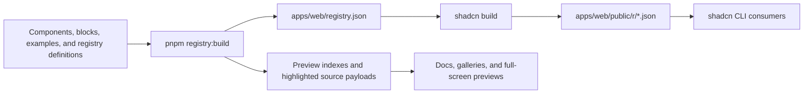

# TentUI

TentUI is a collection of polished React components and landing-page blocks
distributed through a shadcn-compatible registry. This repository contains the
public website, interactive documentation, component previews, registry build
pipeline, and the supporting Cloudflare API stack.

[Website](https://tentui.com) · [Components](https://tentui.com/components) ·
[Blocks](https://tentui.com/blocks)

Install a registry item directly into a shadcn project:

```bash
pnpm dlx shadcn@latest add https://tentui.com/r/3d-button.json
```

## What is in this repository?

- A Next.js documentation site with MDX pages, live previews, source views,
  installation commands, and full-screen block previews.
- A typed source registry for reusable components, examples, and page blocks.
- A build pipeline that formats and highlights source code, creates preview
  metadata, and publishes shadcn registry JSON under `/r`.
- A shared shadcn UI package used by the website itself.
- A Hono and tRPC API worker with Better Auth and a Cloudflare D1 database.
- Cloudflare deployment through OpenNext, Wrangler, and Alchemy.

## Tech stack

| Area | Technology |
| --- | --- |
| Web | Next.js 16, React 19, Tailwind CSS 4, Motion |
| Docs and registry | shadcn, MDX, Fumadocs utilities, Shiki, ts-morph |
| API | Hono, tRPC, Better Auth |
| Data | Drizzle ORM, Cloudflare D1 |
| Infrastructure | OpenNext for Cloudflare, Wrangler, Alchemy |
| Tooling | pnpm, Turborepo, TypeScript, Biome, Husky |

## Project structure

```text
tentui.com/
├── apps/
│   ├── web/                    # Website, docs, previews, and registry builder
│   │   ├── public/r/           # Generated public registry artifacts
│   │   ├── scripts/            # Registry build tooling
│   │   └── src/
│   │       ├── app/            # Next.js App Router routes
│   │       ├── content/        # Component documentation in MDX
│   │       └── registry/       # Components, blocks, examples, and definitions
│   └── server/                 # Hono worker entry point
├── packages/
│   ├── api/                    # tRPC router and request context
│   ├── auth/                   # Better Auth configuration
│   ├── config/                 # Shared TypeScript configuration
│   ├── db/                     # Drizzle schema and migrations
│   ├── env/                    # Shared environment schema and env files
│   ├── infra/                  # Alchemy-managed Worker and D1 resources
│   └── ui/                     # Shared shadcn UI primitives and styles
├── turbo.json                  # Monorepo task graph
└── pnpm-workspace.yaml         # Workspace and dependency catalog
```

## Getting started

### Prerequisites

- Node.js 20.9 or newer
- pnpm 11.8.0 (the version declared by the workspace)
- A GitHub token for the repository star count shown in the site header
- A Cloudflare account and Wrangler credentials when deploying the complete stack

Install the dependencies from the repository root:

```bash
pnpm install
```

### Environment variables

Create `packages/env/.env` for local development:

```dotenv
ALCHEMY_PASSWORD=replace-with-an-alchemy-environment-password
CORS_ORIGIN=http://localhost:3001
BETTER_AUTH_URL=http://localhost:3000
NEXT_PUBLIC_SERVER_URL=http://localhost:3000
BETTER_AUTH_SECRET=replace-with-at-least-32-characters
GITHUB_API_TOKEN=github_pat_replace_me
```

| Variable | Used for |
| --- | --- |
| `ALCHEMY_PASSWORD` | Protecting the Alchemy environment state |
| `CORS_ORIGIN` | Allowed browser origin for the Hono worker |
| `BETTER_AUTH_URL` | Better Auth base URL |
| `NEXT_PUBLIC_SERVER_URL` | Browser-facing tRPC and API URL |
| `BETTER_AUTH_SECRET` | Session signing secret; must contain at least 32 characters |
| `GITHUB_API_TOKEN` | Reading the repository star count from the GitHub API |

Use `packages/env/.env.prod` for production values. Both files are ignored by
Git and should never be committed.

### Run the website

For documentation, component, and block work that does not require the local
API worker:

```bash
pnpm dev:web
```

The site is available at [http://localhost:3001](http://localhost:3001).

To run the website together with the Cloudflare worker and local D1 resource:

```bash
pnpm dev
```

Alchemy starts the API at [http://localhost:3000](http://localhost:3000). The
server is intentionally launched through Alchemy so that its Cloudflare `DB`
binding and secrets are available.

## Registry architecture

Registry definitions are the source of truth. The generated files power both
the website previews and installations in downstream projects.



The custom build step writes:

- `apps/web/registry.json`, the normalized source registry used by shadcn.
- `apps/web/src/registry/__index__.tsx`, lazy component imports for previews.
- `apps/web/src/registry/__items__.json`, formatted and highlighted source code.
- `apps/web/src/registry/__blocks__.json`, block listing metadata.
- `apps/web/public/r/*.json`, the public installable registry generated by
  `shadcn build`.

Do not edit these generated files directly.

## Adding a component or block

1. Add the implementation under `apps/web/src/registry/components` or
   `apps/web/src/registry/blocks`.
2. Register it in the corresponding `_registry.ts` file. Declare every source
   file, package dependency, registry dependency, target path, and category.
3. For a component, add a demo under `apps/web/src/registry/examples` and
   register that demo in `examples/_registry.ts`.
4. Add the component documentation to `apps/web/src/content/components` using
   the component slug as the MDX filename.
5. Rebuild and validate the registry:

   ```bash
   pnpm registry:build
   pnpm registry:validate
   pnpm check-types
   ```

Component docs are statically generated from MDX. The preview components and
displayed source are resolved from the generated registry indexes, so rebuilding
the registry is required whenever a definition or registry source file changes.

### Shared UI primitives

The website's general-purpose shadcn primitives live in `packages/ui`. Add a
primitive from the repository root with:

```bash
pnpm dlx shadcn@latest add accordion -c packages/ui
```

Import shared primitives through the package export map:

```tsx
import { Button } from "@tentui.com/ui/components/button";
```

Design tokens and global styles live in
`packages/ui/src/styles/globals.css`. App-specific registry components should
remain under `apps/web/src/registry` rather than being added to the shared UI
package.

## Available commands

| Command | Description |
| --- | --- |
| `pnpm dev:web` | Start only the Next.js site on port 3001 |
| `pnpm dev` | Start the site and Alchemy-managed Cloudflare resources |
| `pnpm build` | Build the web and server applications through Turborepo |
| `pnpm check-types` | Type-check workspace packages that expose a type-check task |
| `pnpm check` | Run Biome checks and apply formatting or safe fixes |
| `pnpm registry:build` | Regenerate preview metadata and public registry JSON |
| `pnpm registry:validate` | Build, then validate the public registry schema |
| `pnpm db:generate` | Generate Drizzle migrations from the current schema |
| `pnpm deploy` | Deploy the API infrastructure and OpenNext website to Cloudflare |
| `pnpm destroy` | Destroy the Alchemy-managed API and D1 resources |

Husky is installed by `pnpm install`; staged JavaScript, TypeScript, and JSON
files are checked by Biome before commit.

## Database and deployment

Authentication tables are defined in `packages/db/src/schema`. Generate a
migration after changing the schema:

```bash
pnpm db:generate
```

Alchemy provisions D1 and applies migrations from `packages/db/src/migrations`
during development and deployment. The Hono worker exposes Better Auth under
`/api/auth`, tRPC under `/trpc`, and a health response at `/`.

For production, configure `packages/env/.env.prod` and authenticate Wrangler
with the target Cloudflare account before running:

```bash
pnpm deploy
```

The API and D1 database are managed by Alchemy; the Next.js application is
built with OpenNext and deployed separately through Wrangler as part of the same
root command.

## License

Use and redistribution of TentUI items are governed by the
[Tent UI License](https://tentui.com/license). Review it before redistributing
source files or derivative templates. Third-party dependencies and assets remain
subject to their own licenses.

## Acknowledgements

The monorepo was bootstrapped with
[Better-T-Stack](https://github.com/AmanVarshney01/create-better-t-stack) and its
Next.js, Hono, tRPC, Drizzle, and Cloudflare foundation.
